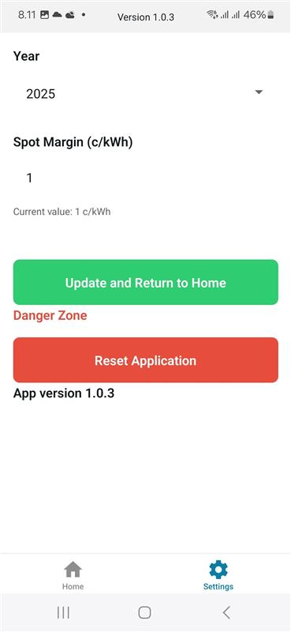

# Sähkö Kulutus App

An Expo React Native application for tracking electricity consumption and prices.

With this app you can track your spot price based contract consumption and pricing even if your electricity supplier does not provide an app.

Note:
You need to have Elenia as your electricity transfer company. This application uses Elenia aina -service credentials to fetch the consumption data. Vattenfall public service is used to fetch the spot prices.

## Screenshots

### Main Screen


The main screen displays real-time electricity consumption data and price information in an easy-to-read format.

### Settings Screen


The settings screen allows users to configure their preferences and input necessary account details for electricity tracking.

## Get started

### Prerequisites

- [Node.js](https://nodejs.org/) (version 16 or newer)
- [Expo CLI](https://docs.expo.dev/) (you can install it globally using `npm install -g expo-cli`)
- For iOS development: macOS with Xcode installed
- For Android development: Android Studio with Android SDK
- For mobile development: Expo Go app on your iOS/Android device or emulators set up on your computer

### Installation

1. Install dependencies
   ```bash
   npm install
   ```

2. Start development
   ```bash
    npx expo start
   ```

For more information about Expo and its requirements, visit the [Expo Documentation](https://docs.expo.dev/).

## Build locally

### Android
To create a local Android build:

1. Make sure you have Android Studio and required SDKs installed
2. Navigate to android directory and clean the project:
   ```bash
   cd android
   ./gradlew clean
   ```
3. Create debug build (for testing):
   ```bash
   ./gradlew assembleDebug
   ```
   The APK will be in `android/app/build/outputs/apk/debug/`

4. Create release build:
   ```bash
   ./gradlew assembleRelease
   ```
   The APK will be in `android/app/build/outputs/apk/release/`

### iOS

iOS build has not been tested